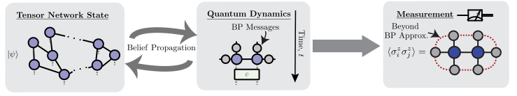

```@meta
CurrentModule = TensorNetworkQuantumSimulator
```

# TensorNetworkQuantumSimulator.jl

A Julia package for simulating quantum circuits, quantum dynamics and equilibrium physics with tensor networks of near-arbitrary geometry. Built on top of [ITensors.jl](https://github.com/ITensor/ITensors.jl) and [NamedGraphs.jl](https://github.com/ITensor/NamedGraphs.jl).



## Features

- **Tensor Networks of Arbitrary Geometry**: 2D and 3D lattices (square, hexagonal, heavy-hex, Lieb, cubic), trees, and custom graphs via [NamedGraphs.jl](https://github.com/ITensor/NamedGraphs.jl).
- **Custom Site Types**: Multiple spin and bosonic modes per tensor, with complete flexibility over where physical degrees of freedom live in the network.
- **Gate Application**: Apply large circuits with full control over SVD truncation via the simple update algorithm with BP-computed environments. Fast, simple, and robust. Full update with boundary MPS environments is also supported for planar graphs. Both real-time and imaginary-time evolution are supported.
- **Expectation Values**: Belief propagation, boundary MPS, and exact contraction backends for computing expectation values of multi-point observables.
- **Entanglement Entropy**: Von Neumann and Rényi entropies from BP messages (per bond) or from reduced density matrices (per subsystem).
- **Sampling**: Sample from planar tensor network states using boundary MPS, with the MPS bond dimension controlling sample quality. Options to compute the importance-sampling ratio ``p(x)/q(x)`` for direct sample quality certification.
- **Operators**: Operator evolution in the Heisenberg picture and density matrix representation.
- **GPU Support**: GPU acceleration via CUDA.jl or Metal.jl. CUDA.jl is highly recommended for large bond dimension simulations, where it can provide dramatic speedups.
- **Arbitrary Precision**: `Float32`, `Float64`, `ComplexF32`, `ComplexF64`, and other numeric types.

## Algorithm Overview

| Algorithm | Keyword | Graph Requirement | Cost | Accuracy |
|-----------|---------|-------------------|------|----------|
| Belief propagation | `alg = "bp"` | Any | Low | Exact on trees, approximate on loopy graphs |
| Boundary MPS | `alg = "boundarymps"` | Planar | Variable (scales cubically in `mps_bond_dimension`) | Controllably accurate, converges to exact with increasing MPS bond dimension |
| Loop corrections | `alg = "loopcorrections"` | Any | Moderate | Systematic corrections to BP; accurate when correlations decay exponentially |
| Exact contraction | `alg = "exact"` | Any (small systems only) | Exponential in system size | Exact |

## Installation

```julia
julia> using Pkg; Pkg.add("TensorNetworkQuantumSimulator")
```

## Documentation Outline

- **[Getting Started](getting_started.md)**: A complete walkthrough from lattice definition to circuit construction, measurement, and sampling
- **[Graphs](graphs.md)**: Defining lattice geometries and graph operations
- **[Tensor Networks](states.md)**: `TensorNetwork` and `TensorNetworkState` types and their construction
- **[Gate Application](gates.md)**: Building circuits and applying gates
- **[Expectation Values](expectation_values.md)**: Computing observables, norms, and overlaps
- **[Entanglement Entropy](entanglement.md)**: Von Neumann and Rényi entropies via BP and boundary MPS
- **[Sampling](sampling.md)**: Drawing bitstring samples from a planar tensor network state with optional certification
- **[Caches](caches.md)**: How the `BeliefPropagationCache` and `BoundaryMPSCache` work and why they matter
- **[Advanced Topics](advanced.md)**: GPU support, loop corrections, and precision control
- **[API Reference](api.md)**: Complete list of documented functions

## References

- **[Jiang2008]** H. C. Jiang, Z. Y. Weng, and T. Xiang, "Accurate Determination of Tensor Network State of Quantum Lattice Models in Two Dimensions," Physical Review Letters **101**, 090603 (2008). [Link](https://journals.aps.org/prl/abstract/10.1103/PhysRevLett.101.090603)
- **[Alkabetz2021]** N. Alkabetz and I. Arad, "Tensor networks contraction and the belief propagation algorithm," Physical Review Research **3**, 023073 (2021). [Link](https://journals.aps.org/prresearch/abstract/10.1103/PhysRevResearch.3.023073)
- **[Tindall2023]** J. Tindall and M. Fishman, "Gauging tensor networks with belief propagation," SciPost Physics **15**, 222 (2023). [Link](https://www.scipost.org/SciPostPhys.15.6.222)
- **[Tindall2024]** J. Tindall, M. Fishman, E. M. Stoudenmire, and D. Sels, "Efficient Tensor Network Simulation of IBM's Eagle Kicked Ising Experiment," PRX Quantum **5**, 010308 (2024). [Link](https://journals.aps.org/prxquantum/abstract/10.1103/PRXQuantum.5.010308)
- **[Evenbly2026]** G. Evenbly, N. Pancotti, A. Milsted, J. Gray, and G. K.-L. Chan, "Loop Series Expansions for Tensor Networks," Physical Review Research **8**, 013245 (2026). [Link](https://arxiv.org/abs/2409.03108)
- **[Tindall2025]** J. Tindall, A. Mello, M. Fishman, M. Stoudenmire, and D. Sels, "Dynamics of disordered quantum systems with two- and three-dimensional tensor networks," arXiv:2503.05693 (2025). [Link](https://arxiv.org/abs/2503.05693)
- **[Rudolph2025]** M. S. Rudolph and J. Tindall, "Simulating and Sampling from Quantum Circuits with 2D Tensor Networks," arXiv:2507.11424 (2025). [Link](https://arxiv.org/abs/2507.11424)
- **[Ferris2021]** A. J. Ferris and G. Vidal, "Perfect sampling with unitary tensor networks," Physical Review B **104**, 235141 (2021). [Link](https://journals.aps.org/prb/abstract/10.1103/PhysRevB.104.235141)

If you use this library in your research, please cite at minimum either:
- M. S. Rudolph and J. Tindall, "Simulating and Sampling from Quantum Circuits with 2D Tensor Networks," arXiv:2507.11424 (2025). [Link](https://arxiv.org/abs/2507.11424)

or

- J. Tindall and M. Fishman, "Gauging tensor networks with belief propagation," SciPost Physics **15**, 222 (2023). [Link](https://www.scipost.org/SciPostPhys.15.6.222)
