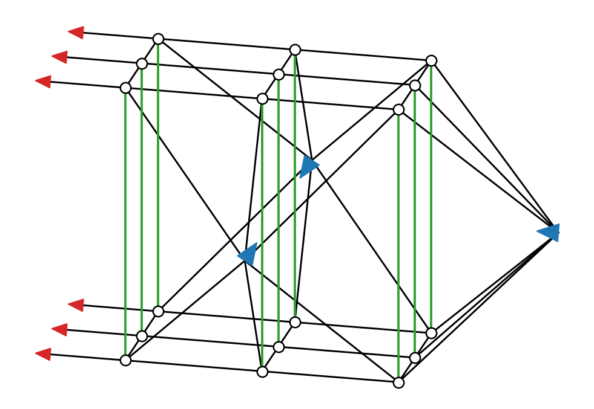
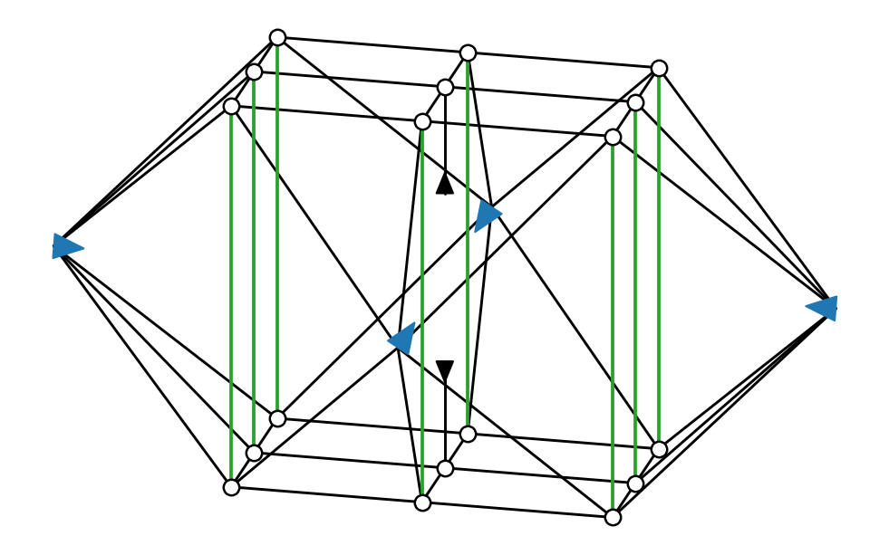
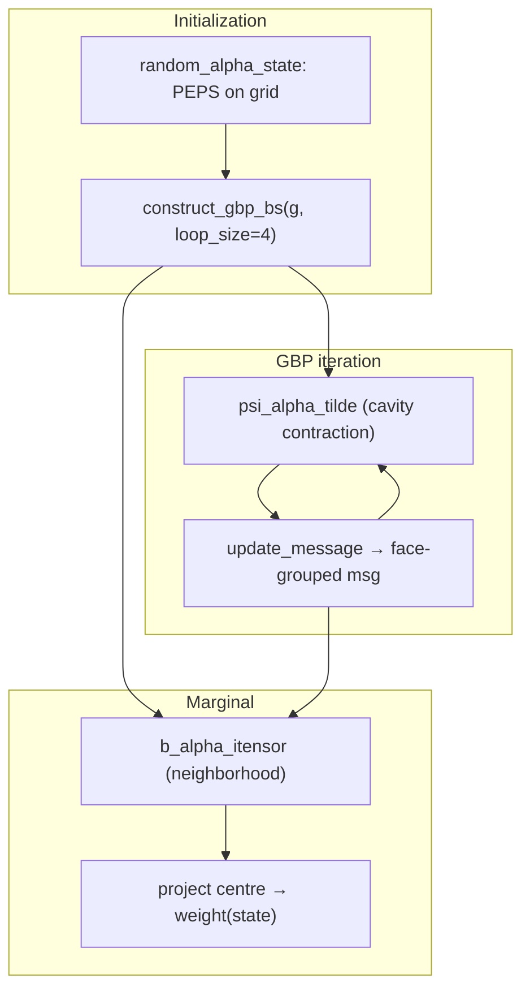

# GBP Sub-Tensor Networks and Contraction Space Complexity

This document maps the two schematic figures to the contractions performed in [`GBP_Test`](../../GBP_Test): the **cavity** sub-TN (message update) and the **neighborhood** sub-TN (marginal / region-belief contraction) on a double-layer norm network.

Parent regions are **n×n** plaquettes of the original lattice (figures use **n = 3**; tables also include **n = 2**). Each schematic is an **n×n×2** double-layer grid:

- **Circles**: site norm factors (ket top / bra bottom)
- **Black bonds**: intra-layer virtual legs, dimension χ
- **Green bonds**: inter-layer traced physical legs, dimension 2
- **Grouped face caps**: one tensor per closed lattice face, with **2n** black legs (n sites × ket/bra)

Regions `bs` come from `construct_gbp_bs(g, loop_size)` (default `loop_size = 4`); child regions `cs` and intersections `ms` follow from region intersections.

For a message update **parent α → child β**, contract parent α's local factor with all **other** incoming child messages fixed. This is the **cavity** sub-TN: the full n×n×2 parent block, with the **separator face** toward β left **open** (split red rank-1 legs in `figs/gbp_cavity.png`, x− face) and the other three faces closed by converged face-grouped messages (blue merged triangles).

For a **single-site marginal** at the centre, contract the owner parent region's belief

```
b_alpha = psi_alpha  *  prod_{child beta} msg[(alpha, beta)]
```

with the centre inter-layer bond broken into ▲/▼ marginal-target caps (`figs/gbp_neighborhood.png`).

---

## 1. Bond-dimension conventions

| Bond | Color | Dimension | Meaning |
|------|-------|-----------|---------|
| Physical / inter-layer | Green | 2 | Traced physical leg between ket and bra |
| Virtual bond χ | Black | 8, 16, 32 | Virtual bond between lattice sites |
| Centre marginal leg | Black (▲/▼) | χ | Open leg when centre physical index is fixed to a state |
| Face-grouped message | Blue triangle | χ per leg (2n legs) | One merged boundary tensor per closed lattice face |

- **sc** = log₂ (largest **intermediate** tensor along the TreeSA-optimal order)
- **tc** = log₂ (total contraction FLOPs)
- Optimizer: TreeSA (`ntrials=20`, `niters=60`, `βs=1:1:18`)

---

## 2. Two sub-TNs and their code mapping

### 2.1 GBP Cavity — message update (`update_message` / `psi_alpha_tilde`)



**Meaning**: To update the face-grouped message from parent α into child β, contract the n×n×2 parent block with three converged face messages (all faces except the separator toward β). The open separator face carries **split** rank-1 legs (red triangles): one per site on that face, per layer.

**Schematic structure**:

- n×n × 2 layers: **2n²** circles
- Intra-layer black bonds + inter-layer green bonds (centre bond **not** broken)
- **Open face** (x− in the figure): **2n** rank-1 red caps
- **Three closed faces**: one merged blue cap each, with **2n** black legs

| Tensor source | Count (3×3) | Count (2×2) | Notes |
|---------------|------------:|------------:|-------|
| Site norm factors | 18 | 8 | n² sites × 2 layers |
| Open-face rank-1 caps | 6 | 4 | 2n caps |
| Closed-face grouped messages | 3 | 3 | One per closed side |
| **Total leaf tensors** | **27** | **15** | TreeSA eincode leaf count |

The actual GBP update maps tensors into a matrix basis via combiners (`to_mat` in `update_message`); the schematic counts bond dimensions on the raw tensor network before that re-indexing. The **sc / tc** numbers in §4 characterise the underlying contraction geometry.

**Code** (`GBP_Test/generalizedbp.jl`):

```110:153:GBP_Test/generalizedbp.jl
function update_message(psi_alpha_cache, psi_beta_cache, alpha, beta, msgs, ps, cs, mobius_numbers;
                        rate = 1.0, combiner_cache=nothing, pat_cache=nothing)
    ...
    for parent_alpha in ps[beta]
        ...
        psi_alpha = ... psi_alpha_tilde_from_full(full_arr, msg_arrays, beta, c_alpha)
        inds_to_sum_over = setdiff(inds(psi_alpha), psi_beta_inds)
        ...
        psi_alpha_arr = gbp_normalize(to_mat(psi_alpha))
        @. λ *= psi_alpha_arr ^ (-A)
    end
    ...
end
```

---

### 2.2 GBP Neighborhood — marginal / region belief (`b_alpha_itensor`)



**Meaning**: Contract the owner parent region with **all four** converged face-grouped child messages; fix the centre site to `|s⟩⟨s|` via broken inter-layer ▲/▼ caps.

**Schematic structure**:

- n×n × 2 layers
- Centre (⌊(n−1)/2⌋, ⌊(n−1)/2⌋): inter-layer green bond → ▲/▼ black caps (dim χ)
- **Four closed faces**: one merged cap each (blue / black triangles in the figure)

| Tensor source | Count (3×3) | Count (2×2) | Notes |
|---------------|------------:|------------:|-------|
| Site norm factors | 18 | 8 | Circles |
| Centre ▲/▼ caps | 2 | 2 | Marginal target legs |
| Face-grouped messages | 4 | 4 | One per lattice side |
| **Total leaf tensors** | **24** | **14** | TreeSA eincode leaf count |

For **n = 2** the schematic centre is (0, 0) — there is no geometric centre on an even grid; any corner site is equivalent under translation on an infinite lattice.

**Code** (`GBP_Test/random_double_layer_marginal.jl`):

```114:121:GBP_Test/random_double_layer_marginal.jl
function gbp_double_layer_marginal(ψ_bpc, bs, cs, msgs, center)
    ...
    psi_open = region_psi_open_site(ψ_bpc, bs[α], center)
    b = b_alpha_itensor(α, psi_open, msgs, cs)
    ...
end
```

---

## 3. Summary table (code ↔ figure ↔ role)

| Figure | GBP step | `GBP_Test` entry point | Region size | Leaf tensors (3×3 / 2×2) |
|--------|----------|------------------------|-------------|-------------------------|
| `figs/gbp_cavity.png` | Message update α→β | `update_message` / `psi_alpha_tilde_from_full` | n×n parent block | 27 / 15 |
| `figs/gbp_neighborhood.png` | Marginal / `b_alpha` | `gbp_double_layer_marginal` → `b_alpha_itensor` | n×n owner region | 24 / 14 |

Message updates are repeated for every `(alpha, beta)` pair in the GBP region graph during `generalized_belief_propagation`. Marginals are evaluated once per physical state after convergence.

---

## 4. Contraction space-complexity results

Below are **sc** and **tc** (log₂) from TreeSA on the schematic eincode networks.

### n = 3 (3×3 — figures)

| Figure | χ=8 sc | χ=8 tc | χ=16 sc | χ=16 tc | χ=32 sc | χ=32 tc |
|--------|-------:|-------:|--------:|--------:|--------:|--------:|
| gbp_cavity | 30.000 | 40.151 | 39.000 | 51.559 | 51.000 | 63.645 |
| gbp_neighborhood | 37.000 | 49.131 | 50.000 | 63.099 | 62.000 | 80.181 |

### n = 2 (2×2)

| Figure | χ=8 sc | χ=8 tc | χ=16 sc | χ=16 tc | χ=32 sc | χ=32 tc |
|--------|-------:|-------:|--------:|--------:|--------:|--------:|
| gbp_cavity | 19.000 | 26.821 | 24.000 | 35.255 | 30.000 | 43.211 |
| gbp_neighborhood | 24.000 | 32.880 | 33.000 | 42.839 | 41.000 | 52.822 |

### Key observations

1. **Face grouping dominates input size**: for n = 3, each closed-face cap has 6 legs → max input tensor 2^(6 log₂ χ) = χ⁶. At χ = 32 this is 2^30 for neighborhood.
2. **sc / log₂(χ) ≈ 10–12** on the 3×3 neighborhood (χ = 8 → 12.33): intermediates must bridge whole faces at once.
3. **Going 2×2 → 3×3** at χ = 8 raises cavity sc from 19 → 30 (+11) and neighborhood sc from 24 → 37 (+13): region area growth dominates over the lower face rank (4 vs 6 legs).
4. **tc grows faster than sc** (e.g. neighborhood 3×3, χ = 32: sc = 62, tc = 80.2): multiple high-rank pairwise contractions accumulate FLOPs even when peak width is bounded by TreeSA.

---

## 5. Running `GBP_Test`

Double-layer marginal on a 3×3 random PEPS (runs GBP to convergence, then evaluates centre marginals):

```bash
julia --project=GBP_Test GBP_Test/random_double_layer_marginal.jl
```

Main entry points:

| File | Role |
|------|------|
| `generalizedbp.jl` | Region graph, `update_message`, `generalized_belief_propagation` |
| `random_double_layer_marginal.jl` | Random double-layer state + centre marginal via `gbp_double_layer_marginal` |
| `utils.jl` | Grid / region helpers used by the drivers |

---

## 6. Data-flow sketch



- **Cavity figure**: contracting `psi_alpha_tilde` over the parent block with three face messages and an open separator face.
- **Neighborhood figure**: contracting `b_alpha` over the same block with four face messages and centre ▲/▼ caps.
