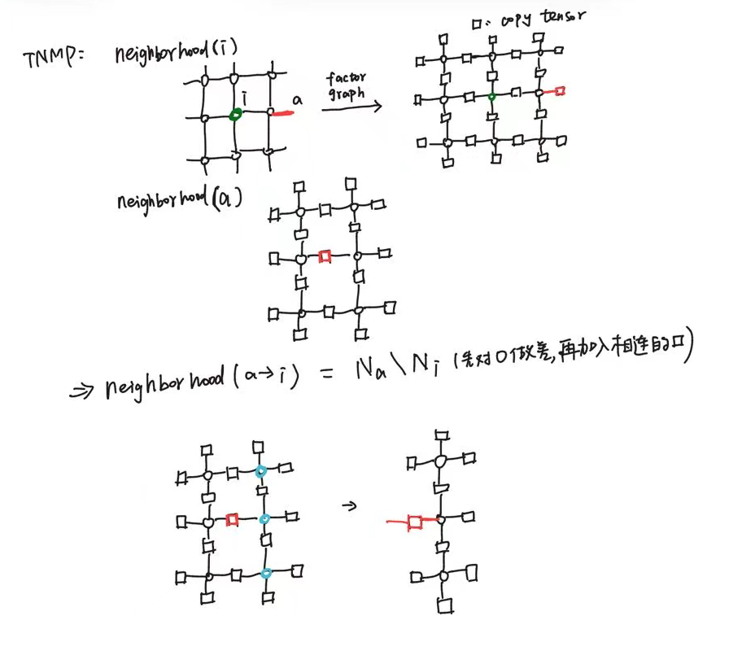
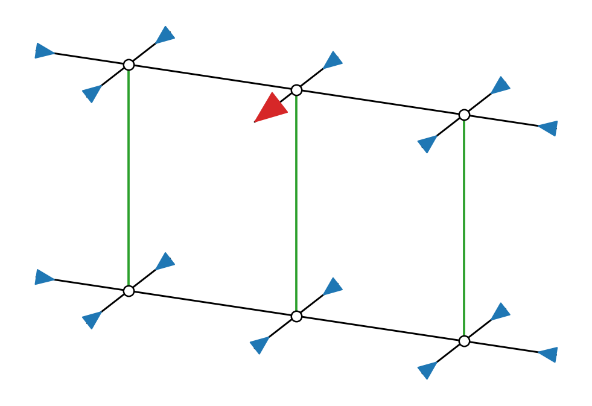
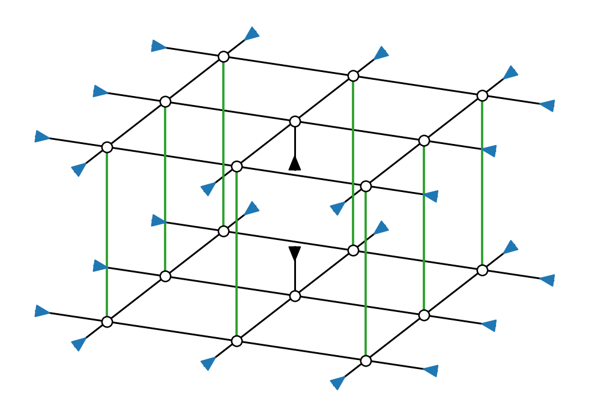
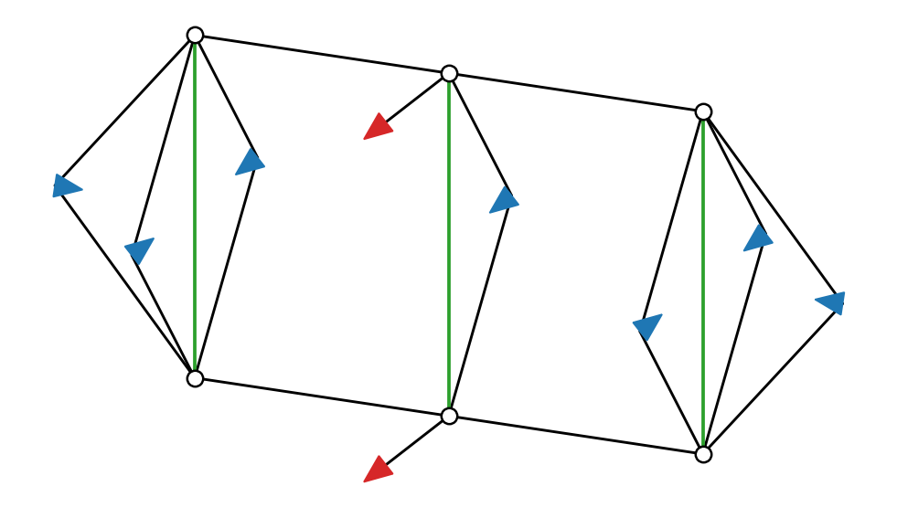
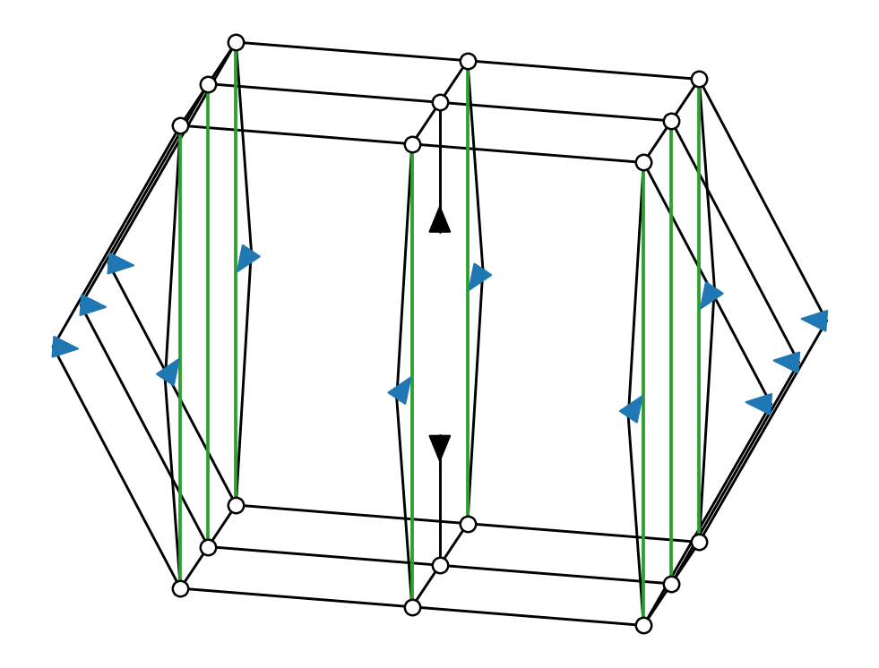
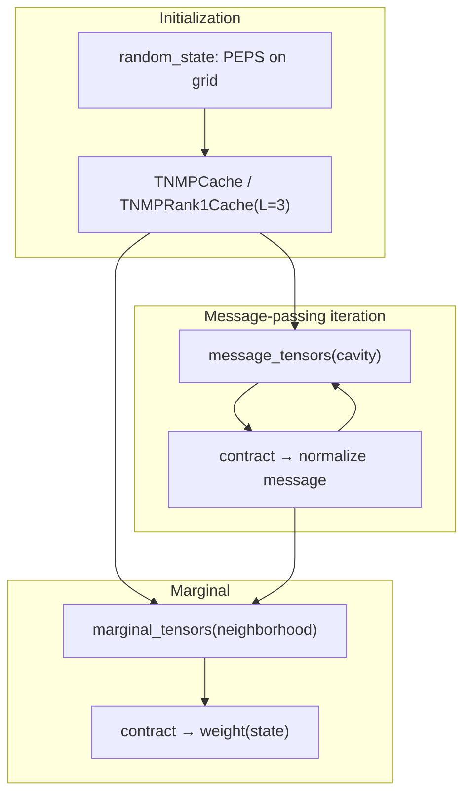

# TNMP Sub-Tensor Networks and Contraction Space Complexity



This document maps the TreeSA contraction-complexity results in [`contraction_sc_results.md`](contraction_sc_results.md) to the four schematic figures and the [`TNMP_test`](../../../TNMP_test) implementation. It explains how the **cavity** (message update) and **neighborhood** (marginal contraction) sub-TNs are built in the **rank-1** and **rank-2** settings.

---

## 1. Background: double-layer TNMP and two message ranks

TNMP on a double-layer (ket + bra) norm network assigns each original site `v` a pair of tensors `[ket, bra]` (`traced_norm_factors`). For a marginal at the center site, the target is fixed to `[ket·δ, bra·δ]` (`fixed_site_norm_factors`).

| Setting | Code module | Boundary messages | Figure convention |
|---------|-------------|-------------------|-------------------|
| **Rank-2 (merged matrix messages)** | `TNMP_test/tnmp.jl` → `TNMPCache` | One rank-2 tensor `M[b, b']` per boundary edge (ket and bra legs merged) | **Diamonds** on the boundary; two black legs connect to ket/bra layers at once |
| **Rank-1 (per-leg vector messages)** | `TNMP_test/tnmp_rank1.jl` → `TNMPRank1Cache` | One rank-1 vector per leg: `x[b]` on ket, `y[b']` on bra | **Triangles** on the boundary; ket and bra each get an independent black leg |

The schematic networks and tensor counts are built in [`contraction_sc.jl`](contraction_sc.jl). In `TNMP_test`, `contraction_sc(tensors)` runs TreeSA on the **same ITensor list** and reports `sc` (log₂ of the largest intermediate tensor, in number of elements).

### Region and cavity definitions

On the subdivision graph `G'` (site nodes + bond nodes), define a neighborhood `N_center` around a center node and `N_a` around a boundary bond node `a`. Then

```
cavity_vertices(a, center) = N_a \ N_center
```

For a square lattice with **L = 3** and the center in the interior (e.g. `(4, 4)` on a 7×7 grid), a message update from the center site along an incoming boundary edge `in_edge` uses a cavity that matches the **3×1 vertical strip** in the figures; a marginal at the center site contracts the **3×3 block**.

Corresponding code:

```384:385:TNMP_test/tnmp.jl
cavity_vertices(cache::TNMPCache, a_node, center_node) =
    setdiff(cache.regions[a_node], cache.regions[center_node])
```

```150:151:TNMP_test/tnmp_rank1.jl
cavity_vertices(cache::TNMPRank1Cache, a_node, center_node) =
    setdiff(cache.regions[a_node], cache.regions[center_node])
```

---

## 2. Bond-dimension conventions

Consistent with [`contraction_sc_results.md`](contraction_sc_results.md) and [`test_contraction_sc.jl`](../../../TNMP_test/test/test_contraction_sc.jl):

| Bond | Color | Dimension | Meaning |
|------|-------|-----------|---------|
| Physical / inter-layer | Green | 2 | Traced physical leg between ket and bra |
| Virtual bond χ | Black | 4, 8, 16, 32 | Virtual bond between lattice sites |
| Center marginal leg | Black (▲/▼) | χ | Open leg when the center site physical index is fixed to a state |

- **sc** = log₂ (largest **intermediate** tensor along the TreeSA-optimal order)
- **tc** = log₂ (total contraction FLOPs)
- Optimizer: TreeSA (`ntrials=5`, `niters=50`, `βs=1:1:15` for the sweep table; `TNMP_test` defaults: `ntrials=20`, `niters=60`, `βs=1:1:18`)

---

## 3. Four sub-TNs and their code mapping

### 3.1 Rank-1 Cavity — message update (`message_tensors`)



**Meaning**: To compute the rank-1 message flowing from boundary bond `a` into center site `i`, contract the double-layer norm factors on the cavity and close every other boundary edge with separate ket/bra rank-1 vector messages. On the open edge, keep **one layer** open and close the opposite layer with its current message.

**Schematic structure** (`build_rank1_cavity`):

- 3 columns × 2 layers (ket top / bra bottom): 6 circles (double-layer site factors)
- Intra-layer black bonds + inter-layer green bonds
- Each open boundary leg capped by a **rank-1 triangle** (3 at corners, 2 on the middle column). The **red** triangles on the middle column facing the center are the cavity opening (one ket, one bra).

**Code construction** (`TNMPRank1.message_tensors`):

```171:191:TNMP_test/tnmp_rank1.jl
function message_tensors(cache::TNMPRank1Cache, center_node, in_edge::NamedEdge, layer::Symbol)
    psi = cache.network
    g = graph(psi)
    a_node = (:bond, cache.canonical[(src(in_edge), dst(in_edge))])
    cav_vs = cavity_vertices(cache, a_node, center_node)
    isempty(cav_vs) && return ITensor[]

    open_edge = reverse_edge(in_edge)
    other_layer = layer === :ket ? :bra : :ket
    bedges = incoming_boundary_edges(g, cav_vs)
    tensors = norm_factors(psi, cav_vs)
    for e in bedges
        if e == open_edge
            push!(tensors, get_message(cache, center_node, in_edge, other_layer))
        else
            push!(tensors, get_message(cache, a_node, e, :ket))
            push!(tensors, get_message(cache, a_node, e, :bra))
        end
    end
    return tensors
end
```

| Tensor source | Count (3×1, L=3) | Notes |
|---------------|------------------|-------|
| `norm_factors(psi, cav_vs)` | 6 (3 sites × 2) | Circles: ket + bra |
| Boundary rank-1 messages | 16 | Non-open edges: ket + bra each; open edge: opposite layer only |
| **Total** | **22** | Matches results table `tensors=22` |

**Test** (χ=8): `contraction_sc(message_tensors(...)) ≤ 9` (the actual update leaves the output leg open, so sc can be slightly below the fully capped schematic value).

---

### 3.2 Rank-1 Neighborhood — marginal contraction (`marginal_tensors`)



**Meaning**: Fix the center site `target` physical leg to `state` and contract its 3×3 neighborhood; attach converged rank-1 messages on the ket and bra legs of every boundary edge.

**Schematic structure** (`build_rank1_neighborhood`):

- 3×3 × 2 layer grid
- Center `(2, 2)`: inter-layer green bond broken into ▲/▼ black caps (marginal target legs)
- Boundary: rank-1 black triangles per layer, one per missing neighbor at each site

**Code construction**:

```275:285:TNMP_test/tnmp_rank1.jl
function marginal_tensors(cache::TNMPRank1Cache, target, state::Integer)
    psi = cache.network
    center_node = (:site, target)
    region = cache.regions[center_node]
    tensors = marginal_factors(psi, region, target, state)
    for e in incoming_boundary_edges(graph(psi), region)
        push!(tensors, get_message(cache, center_node, e, :ket))
        push!(tensors, get_message(cache, center_node, e, :bra))
    end
    return tensors
end
```

| Tensor source | Count (3×3) | Notes |
|---------------|-------------|-------|
| `marginal_factors` | 18 (9 sites × 2, center fixed) | Circles |
| Boundary rank-1 messages | 16 (8 edges × ket/bra) | Triangles |
| Center opening | Inside `fixed_site_norm_factors` | ▲/▼ |
| **Code total** | **34** | ITensors returned by `marginal_tensors` |
| **Schematic leaf count** | **44** | `build_rank1_neighborhood` also counts center ▲/▼ as 2 separate cap tensors |

**Test** (χ=8): `contraction_sc(marginal_tensors(...)) == 15`.

---

### 3.3 Rank-2 Cavity — message update (`message_tensors`)



**Meaning**: Same cavity vertex set as rank-1, but each boundary edge is closed by **one** rank-2 matrix message `δ(b, b')` or the converged `M` that couples ket and bra together. Only the cavity opening edge carries no message (red triangles in the figure).

**Schematic structure** (`build_rank2_cavity`):

- Same 3×1×2 strip as rank-1 cavity
- Corners and middle +y direction: ket–bra **merged diamonds** (one rank-2 tensor per boundary leg; 3 per corner)
- Middle column toward center: **split** rank-1 red triangles (opening)

**Code construction**:

```393:408:TNMP_test/tnmp.jl
function message_tensors(cache::TNMPCache, center_node, in_edge::NamedEdge)
    psi = cache.network
    g = graph(psi)
    a_node = (:bond, cache.canonical[(src(in_edge), dst(in_edge))])
    cav_vs = cavity_vertices(cache, a_node, center_node)
    isempty(cav_vs) && return ITensor[]

    open_edge = reverse_edge(in_edge)
    bedges = incoming_boundary_edges(g, cav_vs)
    tensors = norm_factors(psi, cav_vs)
    for e in bedges
        e == open_edge && continue
        push!(tensors, get_message(cache, a_node, e))
    end
    return tensors
end
```

| Tensor source | Count (3×1) | Notes |
|---------------|-------------|-------|
| `norm_factors` | 6 | Circles |
| Boundary rank-2 messages | 9 | Diamonds (0 on the open edge) |
| **Total** | **15** | Fewer than rank-1's 22 |

**Test** (χ=8): `contraction_sc(message_tensors(...)) == 13`.

---

### 3.4 Rank-2 Neighborhood — marginal contraction (`marginal_tensors`)



**Meaning**: 3×3 neighborhood plus one rank-2 incoming message per boundary edge; center site fixed.

**Schematic structure** (`build_rank2_neighborhood`):

- 3×3 × 2 layers
- Center ▲/▼ black caps
- One **merged diamond** per boundary leg (by missing-neighbor count at each site), coupling ket and bra

**Code construction**:

```461:470:TNMP_test/tnmp.jl
function marginal_tensors(cache::TNMPCache, target, state::Integer)
    psi = cache.network
    center_node = (:site, target)
    region = cache.regions[center_node]
    tensors = marginal_factors(psi, region, target, state)
    for e in incoming_boundary_edges(graph(psi), region)
        push!(tensors, compute_message(cache, center_node, e))
    end
    return tensors
end
```

| Tensor source | Count (3×3) | Notes |
|---------------|-------------|-------|
| `marginal_factors` | 18 | Circles (center fixed included) |
| Boundary rank-2 messages | 8 | Diamonds: one message per undirected boundary bond from `incoming_boundary_edges` |
| **Code total** | **26** | ITensors returned by `marginal_tensors` |
| **Schematic leaf count** | **32** | `build_rank2_neighborhood`: 18 circles + 12 perimeter diamonds + 2 center caps; 12 open legs vs 8 boundary bonds — equivalent topology, **same sc** |

**Test** (χ=8): `contraction_sc(marginal_tensors(...)) == 24` (matches the schematic eincode sc).

---

## 4. Summary table (code ↔ figure ↔ role)

| Figure | TNMP step | Rank | `TNMP_test` entry point | Region size (L=3) | Schematic leaves / code ITensors |
|--------|-----------|------|-------------------------|-------------------|----------------------------------|
| `rank1_cavity.png` | Message update | 1 | `TNMPRank1.message_tensors` | cavity 3×1 | 22 / 22 |
| `rank1_neighborhood.png` | Marginal | 1 | `TNMPRank1.marginal_tensors` | neighborhood 3×3 | 44 / 34 (18 factors + 16 messages) |
| `rank2_cavity.png` | Message update | 2 | `TNMPTest.message_tensors` | cavity 3×1 | 15 / 15 |
| `rank2_neighborhood.png` | Marginal | 2 | `TNMPTest.marginal_tensors` | neighborhood 3×3 | 32 / 26 (18 factors + 8 messages) |

> The `tensors` column in [`contraction_sc_results.md`](contraction_sc_results.md) counts leaf tensors in the schematic eincode. The ITensor list from `TNMP_test` may differ in how boundary objects are counted (open legs vs boundary bonds), but **sc is aligned** at χ=8, L=3 by the unit tests.

Message updates are called repeatedly for each `(center_node, in_edge)` (and `layer ∈ {ket, bra}` in rank-1) during TNMP iteration. Marginals are called once per physical state `state` in `tnmp_marginal`.

---

## 5. Contraction space-complexity results

Full sweep data: [`contraction_sc_results.md`](contraction_sc_results.md). Below are the **sc** values (log₂ of largest intermediate tensor size).

### N = 3 (3×1 cavity / 3×3 neighborhood)

| Figure | χ=4 | χ=8 | χ=16 | χ=32 |
|--------|----:|----:|-----:|-----:|
| rank1_cavity | 5.000 | 9.000 | 13.000 | 16.000 |
| rank1_neighborhood | 11.000 | 15.000 | 19.000 | 23.000 |
| rank2_cavity | 9.000 | 13.000 | 17.000 | 21.000 |
| rank2_neighborhood | 16.000 | 24.000 | 32.000 | 40.000 |

### N = 5 (5×1 cavity / 5×5 neighborhood)

| Figure | χ=4 | χ=8 | χ=16 | χ=32 |
|--------|----:|----:|-----:|-----:|
| rank1_cavity | 5.000 | 10.000 | 13.000 | 16.000 |
| rank1_neighborhood | 24.000 | 29.000 | 34.000 | 39.000 |
| rank2_cavity | 9.000 | 13.000 | 17.000 | 21.000 |
| rank2_neighborhood | 25.000 | 37.000 | 49.000 | 61.000 |

### Key observations

1. **Rank-2 cavity sc exceeds rank-1** (χ=8: 13 vs ≤9): merged matrix messages make boundary bond dimension χ², producing larger intermediates.
2. **Rank-2 neighborhood sc also exceeds rank-1** (χ=8: 24 vs 15): one χ×χ message per boundary bond vs two χ vectors, yet fewer total leaf tensors (32 vs 44 in the schematic).
3. **Cavity sc grows roughly linearly in log₂ χ** (coefficient ≈ 3–4); **neighborhood sc grows faster with lattice side N** (rank-1: 15 → 29 @ χ=8 when going 3×3 → 5×5).
4. **Rank-2 neighborhood sc / log₂(χ) ≈ 8** (3×3), consistent with χ² coupling on perimeter rank-2 bonds.

---

## 6. Reproducing the results

### Schematic sc sweep

```bash
julia TensorNetworkQuantumSimulator_q.jl/docs/figures/contraction_sc.jl
```

### TNMP_test unit tests (χ=8, L=3, interior center on 7×7)

```bash
julia --project=TNMP_test TNMP_test/test/runtests.jl
```

See [`test_contraction_sc.jl`](../../../TNMP_test/test/test_contraction_sc.jl): calls `contraction_sc` directly on the ITensor lists from `message_tensors` / `marginal_tensors`, matching the χ=8, N=3 columns above.

### Minimal example scripts

```bash
julia --project=TNMP_test TNMP_test/random_double_layer_marginal_rank1.jl   # rank-1
julia --project=TNMP_test TNMP_test/random_double_layer_marginal.jl         # rank-2
```

---

## 7. Data-flow sketch



- **Cavity figures**: `message_tensors` takes `norm_factors` on `cavity_vertices` plus boundary messages.
- **Neighborhood figures**: `marginal_tensors` takes `marginal_factors` on `regions[(:site, target)]` plus incoming boundary messages.

This is the complete mapping between the four schematic figures and the `TNMP_test` implementation.
